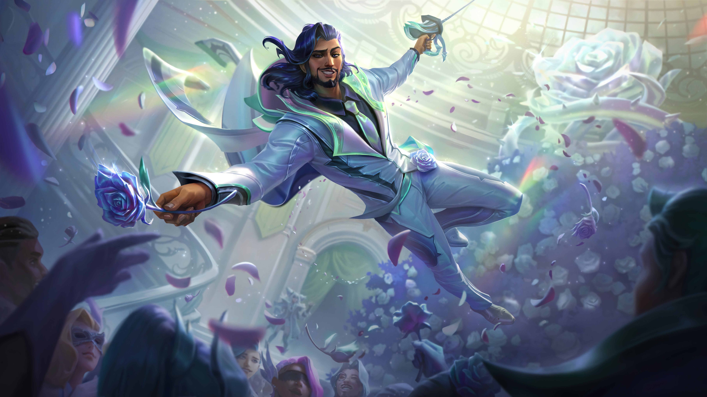

# **Busel Yakov**

# __Where YOU can find and contact me__


### you can call me with **phone number**: +375257623303
### my **e-mail**: leagueplayersmell@gmail.com
### me on **vk page**: https://vk.com/nuraltan

# __About me__
## _Strengths_:
### One of my primary assets is my capacity to swiftly grasp novel concepts and technologies. I possess a sharp analytical mindset and keen attention to detail, enabling me to efficiently resolve intricate problems. Moreover, I excel in communication and thrive in collaborative environments, fostering productive teamwork and the exchange of ideas.

## Passion for Learning:
### What sets me apart is my unwavering enthusiasm for continuous learning and personal growth. I constantly seek out new tools, methodologies, and advancements in my field. This drive propels my dedication to staying up-to-date with the latest industry trends and best practices, enabling me to adapt swiftly and contribute effectively to evolving projects.

## Conclusion:
### In conclusion, I am an enthusiastic professional committed to pursuing my programming career goals. With a solid foundation, a fervent passion for learning, and the ability to tackle new challenges, I am confident in my capacity to make a significant impact on any team or project.

 # _Skills Acquired During University Education_
* programming languages:
    * C#, 
    * C++
    * Python
* Frameworks:
    *DotNet
* Development Tools:
    * VS Code
    * VS Studio
    * Enterprise Architect

 # __Code examples__
## **C#**

```

public int Factorial(int number)
{
    if (number <= 1)
        return 1;
    else
        return number * Factorial(number - 1);
}

```
## **C++**

```

bool isPrime(int number)
{
    if (number <= 1)
        return false;

    for (int i = 2; i * i <= number; i++)
    {
        if (number % i == 0)
            return false;
    }

    return true;
}

```
## **Python**
```

num1 = 5
num2 = 3

sum = num1 + num2

 print("Сумма чисел:", sum)
  

```
